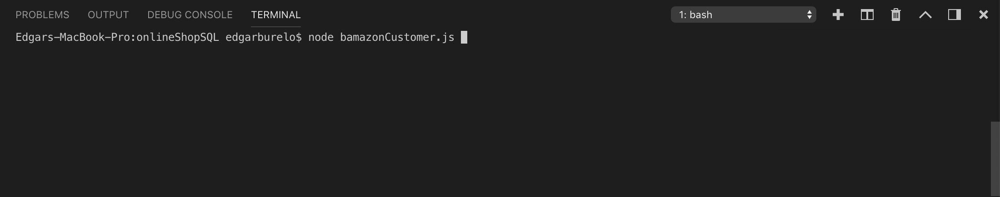
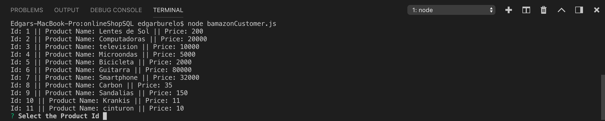
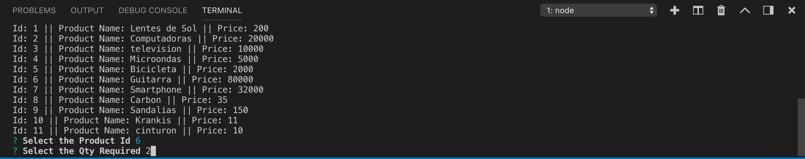
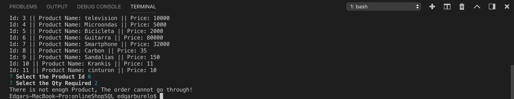
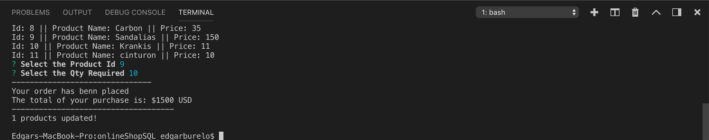

# onlineShopSQL

#Online Shop Customer
As a Customer First of all you should start the node application through the "node bamazonCustomer.js":

Once executed the code, in the therminal, it will be displayed all the avalibe products and the program will ask the customer which product want to select by the product_Id::

With the product selected the customer should indicate how many items from the product does he wants:

If there isn't enough product in the warehouse the program will inform the customer and the order will not be placed:

But if there is enough product, the order will be placed according to the customer selection:

#Online Shop Manager