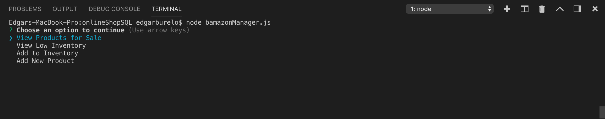
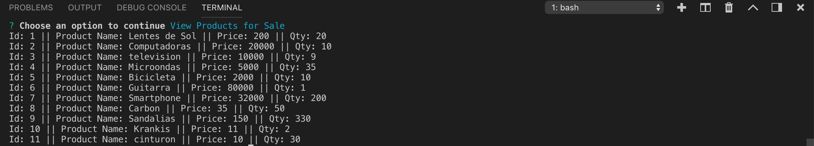
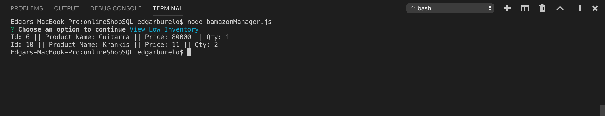
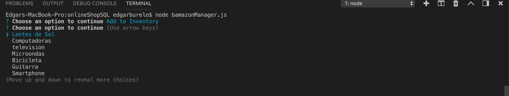
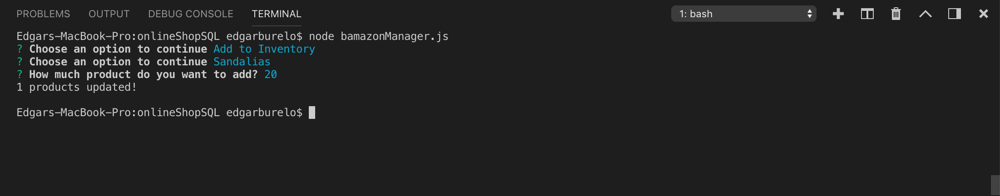
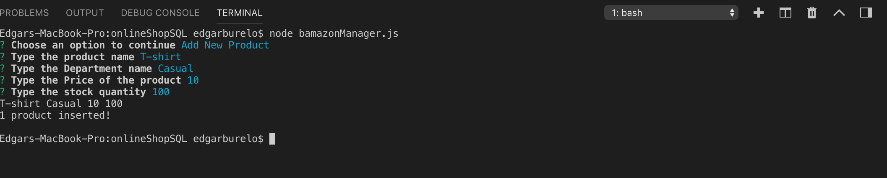
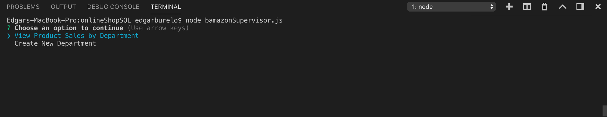
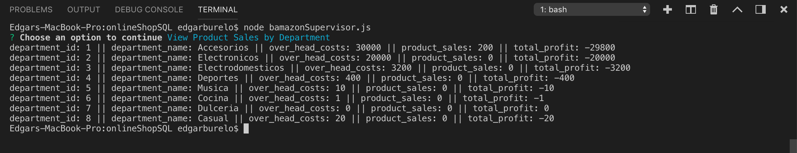
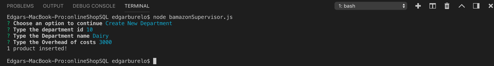

# onlineShopSQL

## Online Shop Customer

As a Customer First of all you should start the node application through the "node bamazonCustomer.js":

Once executed the code, in the therminal, it will be displayed all the avalibe products and the program will ask the customer which product want to select by the product_Id::

With the product selected the customer should indicate how many items from the product does he wants:

If there isn't enough product in the warehouse the program will inform the customer and the order will not be placed:

But if there is enough product, the order will be placed according to the customer selection:

## Online Shop Manager

For the Manager there is the "bamazonManager.js" file which will help him with 4 different options: View Products for Sale, View Low Inventory, Add to Inventory and Add New Product.

When the manager executes the "node bamazonManager.js" there will be prompted the four option to select:

### View Products for Sale

When the "View Products for Sale" is selected, all the products will be displayed in the console. With the Product id, Product Name, Price and Qty for each one.

### View Low Inventory

The difference between "View Low Inventory" and "View Products for Sale" option is that in this one the products shown will be the ones with lower than 5 units in stock.

### Add to Inventory

In the "Add to Inventory" Option the Manager will need to select the product and then write the qty of product that will be added to the Inventory.

### Add New Product

For the "Add new Product" option the manager will need to input the name, department, Price and Qty for the product he is adding, it is very important that the price and qty are numbers, if no the product it will no be added.

## Online Shop Supervisor

For the Supervisor there is the "bamazonSupervisor.js" file which will help him with 2 different options: View Product Sales by Department and Create New Department.

When the Supervisor executes the "node bamazonSupervisor.js" there will be prompted the two option to select:

### View Product Sales by Department

When the "View Products for Sale" is selected a table will be displayed with 5 different columns: department_id, department_name, over_head_costs, product_sales and total_profit.

### Create New Department

When the "Create New Department" is selected the supervisor will need to introduce the id, name and cost for the department and the talbe will be updated.
